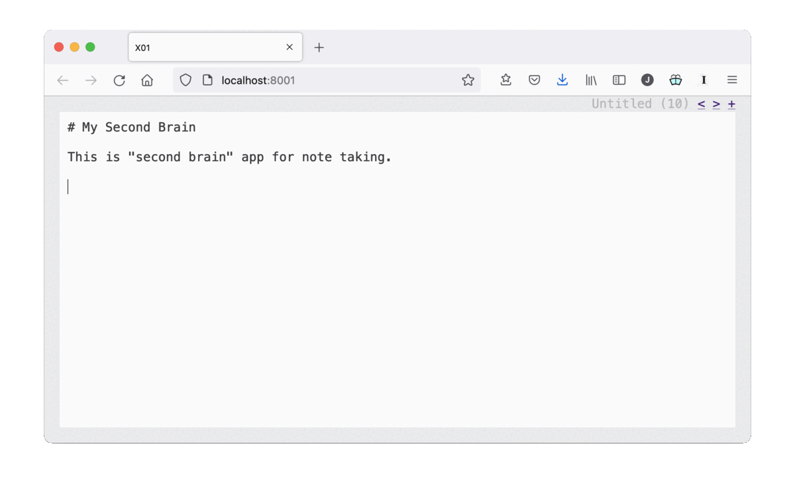

# Nolific (X1)

A very simple web based note solution that's designed to serve as my second brain.



## Getting Started

To start the tool simply clone the repo and then run PHP in server mode (for development and testing only) from the repo's root directory.

```
git clone git@github.com:codazoda/nolific.git
cd nolific
php -S 0:8001
```

Then open your web browser and point it to `http://localhost:8001`. The default username is `admin` and the default password is also `admin`.

## Requirements

Nolific uses PHP with SQLite3. I'm using PHP 7.4.23 at the time of this writing.

Most Mac's have this installed by default. How you install it on other systems will depend on the system. On a Debian based system you might use something like the following command.

```
apt-get install php7.4 php7.4-sqlite3
```

## More Information

The back-end of this is currently a very poorly written PHP application. I wrote part of the application before I figured out how I wanted to organize it. Still, it's a really simple application and I plan to clean it up later. In the long term I'm thinking I may re-write it in GO once I get a feel for how it works for me. PHP is the language I use professionally and have for many years, so it currently serves as my hammer.

The front-end uses htmx (but there's also a little bit of old JS code in there too). Just like the back-end, I added a bit of code before I settled on htmx. This is also my first time using htmx.

## X as in Experiments

This tool was originally called X1 and I've now renamed it to Nolific.

Naming software experiments is a barrier to entry for me. Typically, I need to come up with a name before I can even create a project. Using numbers removes that burden and lets me start with a readme or a bit of code. This is the first of those numbered experiments.

Because their numbered, I can more easily decide on ports and domain names to run them on. For example, for development work, I'll run experiments on port 8000-8999. Since this is experiment number one, I'll run it on port 8001.

## Running Automatically on Mac

I've created a `com.joeldare.nolific.plist` file that starts the system automatically on localhost. I symlink this file from `~/Library/LaunchAgents` and the Mac OS launchd system will launch it automatically and keep it running.

## Release Notes

**v0.0.2**

The second public release. Still very much experimental but coming together with a really useful feature set.

- Update the project name from X1 to Nolific
- Add username/password authentication
- Add a search feature
- Add Material UI icons to make the UI nicer
- Update the new page button to create a new page only if a blank page doesn't already exist
- Update the license from proprietary to AGPLv3
- Add a plist file to start the app automatically on Mac
- Add a FAQ explaining the license rationale
- Add a contributing doc to note personal maintenance commands
- Add acknowledgments for third party tools that are used by the project
- Initial nolific.com page
- Add Action menu (does nothing right now)

**v0.0.1**

First public release, which was posted on Show HN.

## Acknowledgments

Nolific is currently written in [PHP](https://php.net) which is licensed under their own BSD-style license certified by the OSI.

Nolific uses SQLite3 as a database backend to store your notes. SQLite3 is in the public domain.

Nolific uses [HTMX](https://htmx.org/) which is distributed under the BSD 2-Clause License.

Nolific uses [Material UI icons](https://developers.google.com/fonts/docs/material_icons) from Google which are distributed under the Apache License Version 2.0.
